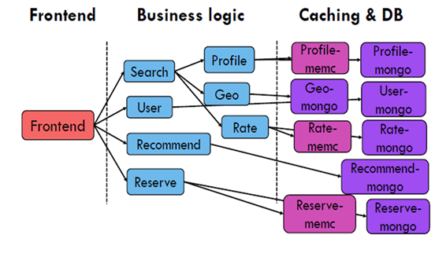

# Hotel Reservation

A hotel reservation microservice, built with Go and gRPC, based on https://github.com/harlow/go-micro-services.

Supported actions: 

* Get profile and rates of nearby hotels available during given time periods
* Recommend hotels based on user provided metrics
* Place reservations



## Preqreqs

#### Environmental checklist🧾

| Configuration item | Specific configuration |
| :----------------: | :--------------------: |
|         OS         |        centos7         |
|     Kubernetes     |         v1.18+         |

Have Installed the nfs-client-provisioner,it will create the pv and pvc we need.

```shell
kubectl apply -f $(pwd)/deploy/storageclass/.
```


## Steps to install HotelReservation

```shell
sh $(pwd)/deploy/deploy.sh
```


## Steps to uninstall HotelReservation

```shell
sh $(pwd)/deploy/undeploy.sh
```


## To test HoetReservation

```shell
USERS=1 EXP_TIME=80s docker-compose -f $(pwd)/locust/docker-compose.yml up --scale worker=1
```

PS: In docker-compose.yml:
   1)、--host http://172.16.84.129:5000     The IP Address need to be changed
   2)、\- $HOME/sinan_locust_log:/mnt/locust_log     $HOME/sinan_locust_log,the directory must exist,you can decide to store where


## There are still problems: 

1. You need to specify which node to deploy on in yaml. 